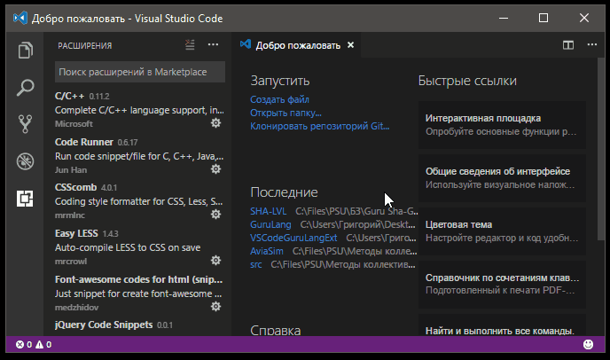
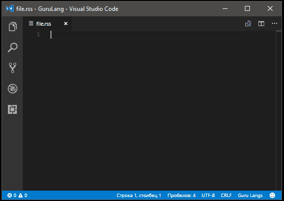
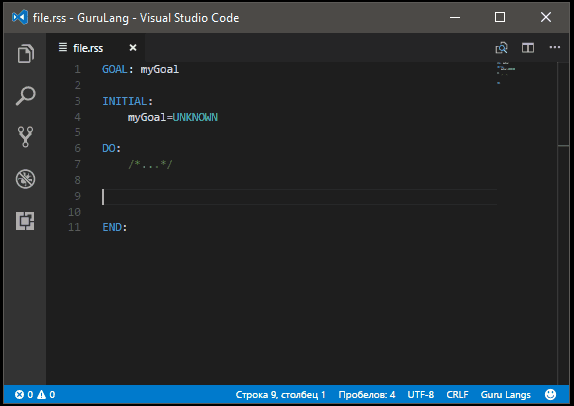
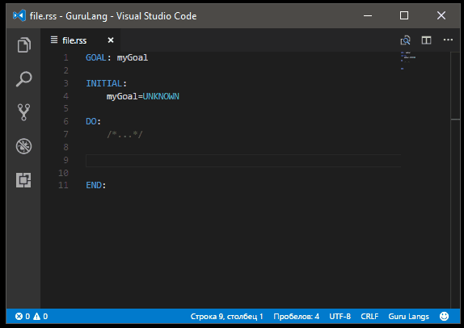
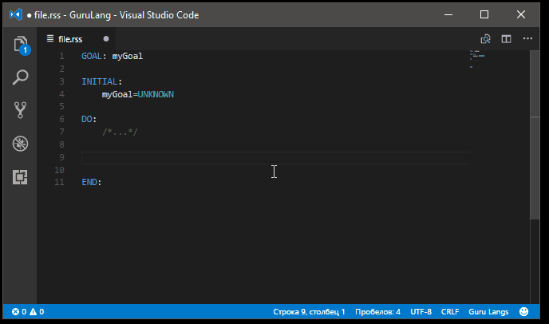
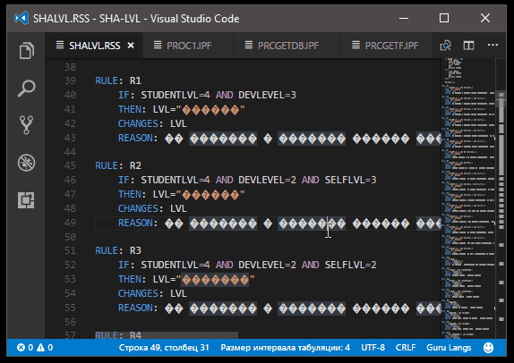

# Guru Lang README

This is a base for supporting Guru (an old DOS expert system shell).
It isn't complete. I have written it just for task I'm solving...
There is basic language hightlighting and snippets.
If you want something to add - just write to me.

## Installing

First you need to Install this the most Modern and Awesome Open Source Code Editor "Visual Studio Code".

Then you need to install this extension. Use search on the extension menu on the left menu or just press CTRL+P and type `ext install gurulang`

Don't forget to check for updates! (you will see a circle with a number on the Extension menu icon).

## Features

1. Base Hightlighting.

2. Snippets. In VS Code you can use snippets. Just start to write snippet name and press `TAB`. Then use `TAB` to switch to next the place in snippet if any and `ENTER` to finish.

### Guru

Snippet `Guru` helps to make basic RSS file template.

### Rule

Snippet `Rule` helps to make basic RULE section template.

### Var

Snippet `Var` helps to make basic VAR section template.

### VarForm

Snippet `VarForm` helps to make basic RULE section template using simple FORM.

Note that the form name is editing everywhere on the template at the same time.

### VarProc

Snippet `VarProc` helps to make basic VAR section template using PROC1 by Svetlana Chuprina.

Note that the variable name is editing everywhere on the template at the same time.

### VarGetVar

Snippet `VarPGETFDB` helps to make basic Var section template using my procedure (you can find it on the [repository](https://raw.githubusercontent.com/Sha-Grisha/VSCodeGuruLangExt/master/files/PGETFDB.IPF).

It works the same as previous..

## Important! Encoding!

Don't forget that Guru is DOS software. So, you MUST use DOS encoding. For example, for Cyrillic it's CP 866.

Look how to switch encoding in VS Code. (Click on the bottom)

## Copyrights and License

License - [MIT License](LICENSE.md).

Author - (Shartsev Grigorii) Sha-Grisha