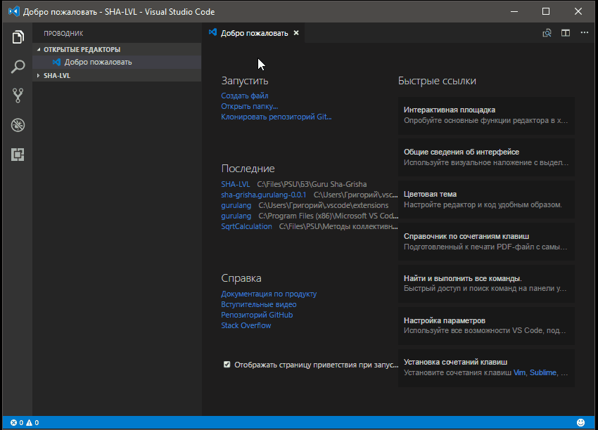

# Guru Lang README

This is a base for Guru (an old DOS expert system shell).
It isn't complete. I have written it just for me...
There is basic language hightlighting and snippets

## Features

## Known Issues

There are not many keywords for hightlighting. Write me, if it need to add smth...